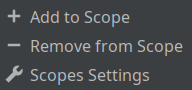
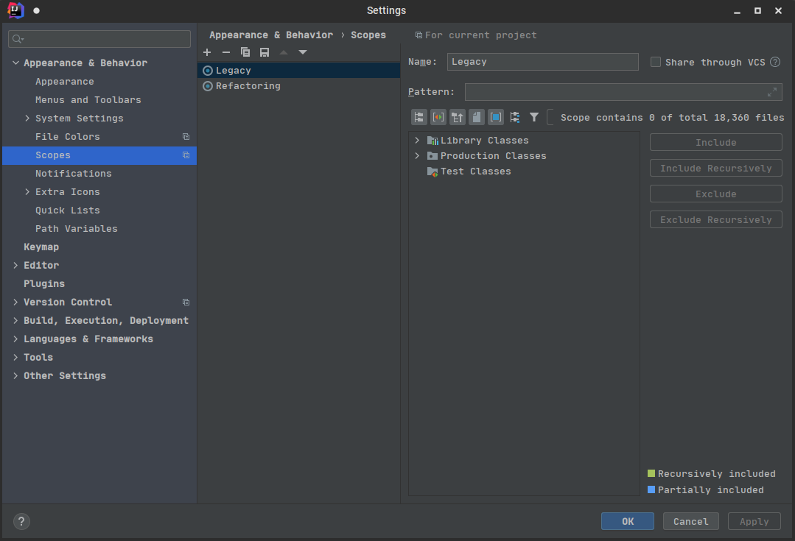
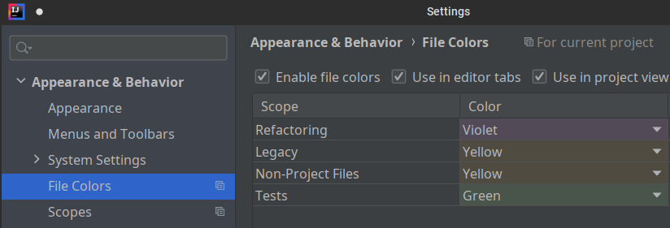
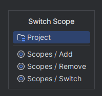
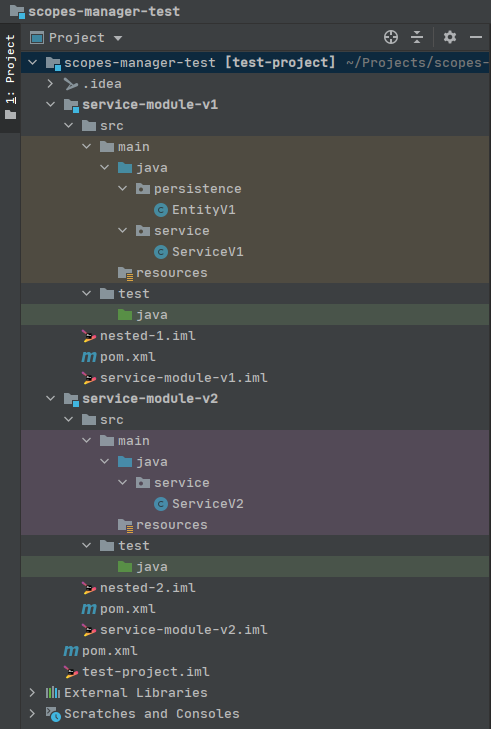

# Scopes Manager IntelliJ Plugin

Scopes bring more structure and easier navigation across the project tree. 
Scopes Manager Plugin is important for handy scopes management of the project resources.
Any file or folder can be assigned to a scope (or unassigned) right from the tree view.

Plugin extends context menu of the project tree with a couple of new items:

### Scopes Settings

There are two settings navigation shortcuts in this group:
* Scopes List
* Scopes Colors

#### Scopes List

Navigates to Scopes Settings where scopes can be defined:

#### Scopes Colors

Navigates to Colors Settings where colors can be assigned to scopes:

### Add to Scope

Shortcut: `Alt + S` / `⌥+S` (can be reassigned in IDEA settings)

The Scope can be either selected from existing ones or created new.
Additionally, if Tasks Management plugin is enabled and used (any non-default task exist),
then new Scopes can be created for available tasks.

### Remove from Scope

Shortcut: `Alt + D` / `⌥+D` (can be reassigned in IDEA settings)

Allows to remove selected resources from the scope.

### Switch Scope

Shortcut: `Alt + A` / `⌥+A` (can be reassigned in IDEA settings)

Opens a popup with all user-defined scopes and switches the Project view to the selected one without leaving the keyboard.
The first entry, `Project`, disables the Scope view and returns to the regular Project view.
Also, discoverable via `Find Action` (`Ctrl+Shift+A` / `⇧⌘A`) as `Switch Scope`.

### Clear Scope

Allows to clear the scope content completely.

### MCP Server Integration

When the bundled [MCP Server](https://plugins.jetbrains.com/plugin/26071-mcp-server) plugin is enabled,
Scopes Manager exposes two tools to MCP clients (Claude Code, Cursor, etc.):

* `get_scopes` — returns the names of all user-defined scopes (local + shared).
* `get_scope_files(name)` — returns the files and folders that comprise the given scope as
  project-relative physical paths, with a trailing `/` on recursive folders. Module
  patterns are resolved to actual content roots (excluding generated sources), so output
  matches what users see in the Project view for both single-module and multi-module
  Gradle/Maven layouts.

This lets AI assistants reason about how the project is structured beyond the file tree.

## Sample View

## ☕ Support

Enjoying this plugin?

## Contributing

See [CONTRIBUTING.md](./CONTRIBUTING.md) for contribution guidelines
and DCO signoff requirements.
