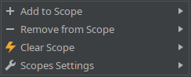

# Scopes Manager IntelliJ Plugin

Scopes bring more structure and easier navigation across the project tree. 
Scopes Manager Plugin is important for handy scopes management of the project resources.
Any file or folder can be assigned to a scope (or unassigned) right from the tree view.

Plugin extends context menu of the project tree with a couple of new items:

### Scopes Settings

There are two settings navigation shortcuts in this group:
* Scopes List
* Scopes Colors

#### Scopes List

#### Scopes Colors

### Add to Scope

Shortcut: `Alt + Num+` (can be reassigned in IDEA settings)

### Remove from Scope

Shortcut: `Alt + Num-` (can be reassigned in IDEA settings)

## Sample View

