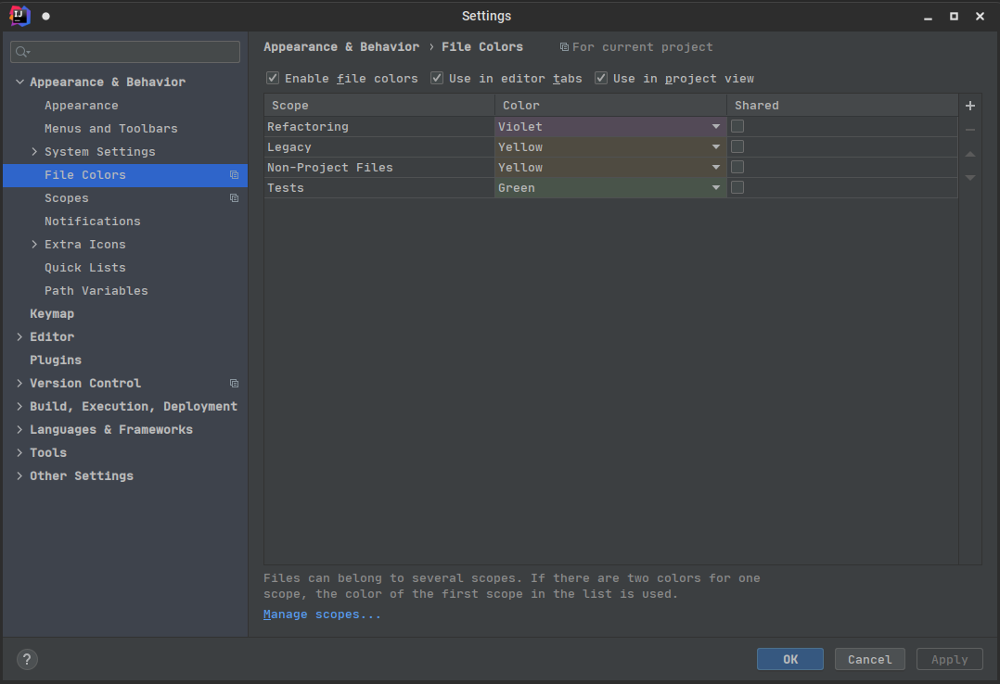

# Scopes Manager IntelliJ Plugin

Scopes bring more structure and easier navigation across the project tree. 
Scopes Manager Plugin is important for handy scopes management of the project resources.
Any file or folder can be assigned to a scope (or unassigned) right from the tree view.

Plugin extends context menu of the project tree with a couple of new items:

### Scopes Settings

There are two settings navigation shortcuts in this group:
* Scopes List
* Scopes Colors

#### Scopes List

Navigates to Scopes Settings where scopes can be defined:

#### Scopes Colors

Navigates to Colors Settings where colors can be assigned to scopes:

### Add to Scope

Shortcut: `Alt + S` / `⌥+S` (can be reassigned in IDEA settings)

The Scope can be either selected from existing ones or created new.
Additionally, if Tasks Management plugin is enabled and used (any non-default task exist),
then new Scopes can be created for available tasks.

### Remove from Scope

Shortcut: `Alt + D` / `⌥+D` (can be reassigned in IDEA settings)

Allows to remove selected resources from the scope.

### Clear Scope

Allows to clear the scope content completely.

## Sample View

